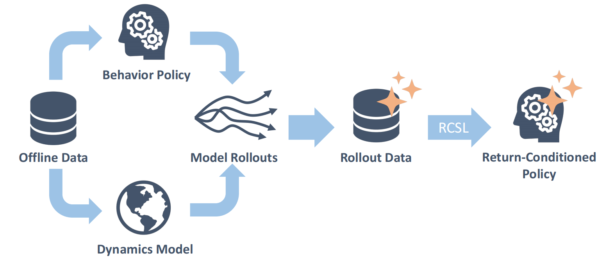

I am a senior student of Yao Class at [IIIS](https://iiis.tsinghua.edu.cn/en/), [Tsinghua University](https://www.tsinghua.edu.cn/en/). 
I currently work on reinceforcement learning, such as multi-agent
RL and offline RL. I aim at designing RL algorithms that are both theoretically sound and applicable in practice. In a broader sense, I have a wide interest in machine learning theory and applications, including but not limited to deep learning, robotics, game theory, optimization and control.

# Selected Research
<!-- - June 2023 - now: Optimization, supervised by Prof. [Jingzhao Zhang](https://sites.google.com/view/jingzhao/home). We hope to extend parameter-free optimization in stochastic gradient setting. -->
## Model-based return-conditioned supervised learning
Research intern at UW (Feb. 2023 - Aug. 2023).

Supervisor: [Simon S. Du](https://simonshaoleidu.com/). 

<!--  -->
 

We proposed model-based return-conditioned supervised learning (**MBRCSL**), a novel offline RL framework that is able to do trajectory stitching while retaining the strength of return-conditioned supervised learning (RCSL) to avoid Bellman completeness requirements.

<!-- - Feb 2023 - now: Offline RL, supervised by Prof. [Simon Shaolei Du](https://simonshaoleidu.com/) at University of Washington. We aim to discover advantages of decision transformer (DT) over classical offline RL algorithms from theoretical perspective, and improve DT to cope with issue of trajectory stitching.  -->

## Networked Markov Potential Games
Remote research intern at Caltech (Feb. 2022 - Feb. 2023).

Supervisor: [Adam Wierman](https://adamwierman.com/).

We proposed networked Markov potential games (NMPG) as a more practical relaxation of Markov potential games (MPG), and designed a localized actor-critic algorithm with provable finite-sample bound.

<!-- - Feb 2022 - Feb 2023: Networked MARL, supervised (remotely) by Prof. [Adam Wierman](https://adamwierman.com/) at Caltech. We introduced a class of networked Markov potential games, designed a localized actor-critic algorithm and derived the first finite-sample bound for multi-agent competitive games that is independent of the number of agents. See our paper on [arXiv](https://arxiv.org/abs/2303.04865). -->

<!-- # Skills
- Proficient in mathematical knowledge for ML research: calculus, linear algebra, abstract algebra, probability theory and optimization. 
- Experienced in common programming language: C++, Python, Go, Verilog.
- Familiar with AI frameworks: Pytorch -->

# News
- Aug 2023: Participate in UAI 2023.
- May 2023: [Paper](https://arxiv.org/abs/2303.04865) accepted by UAI 2023! Thanks for generous support from Dr. [Zaiwei Chen](https://www.zaiweichen.com/home), [Yiheng Lin](https://yihenglin97.github.io/) and Prof. [Adam Wierman](https://adamwierman.com/).
- Feb 2023: Begin my spring visit at UW. Look forward to cooperation with Prof. [Simon Shaolei Du](https://simonshaoleidu.com/).